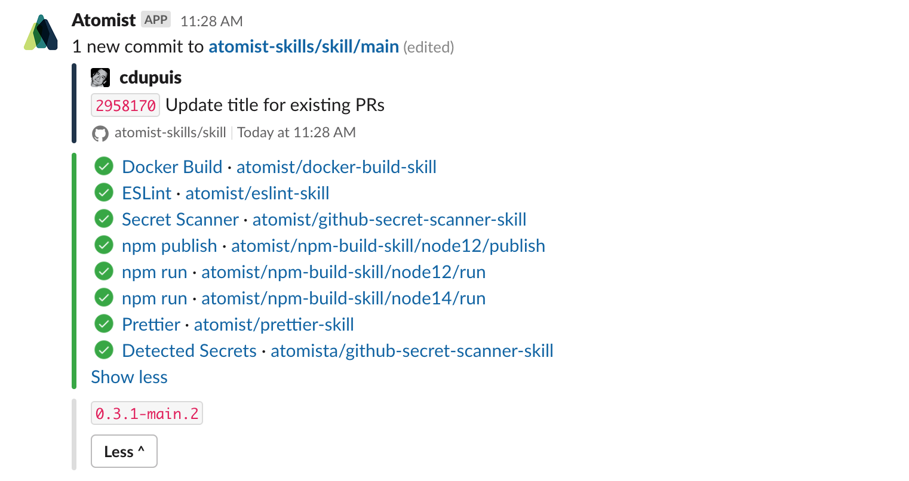
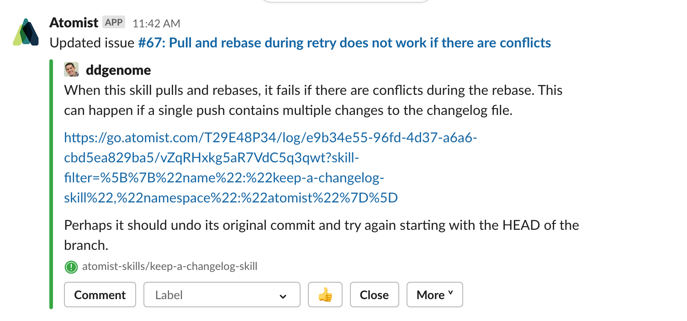
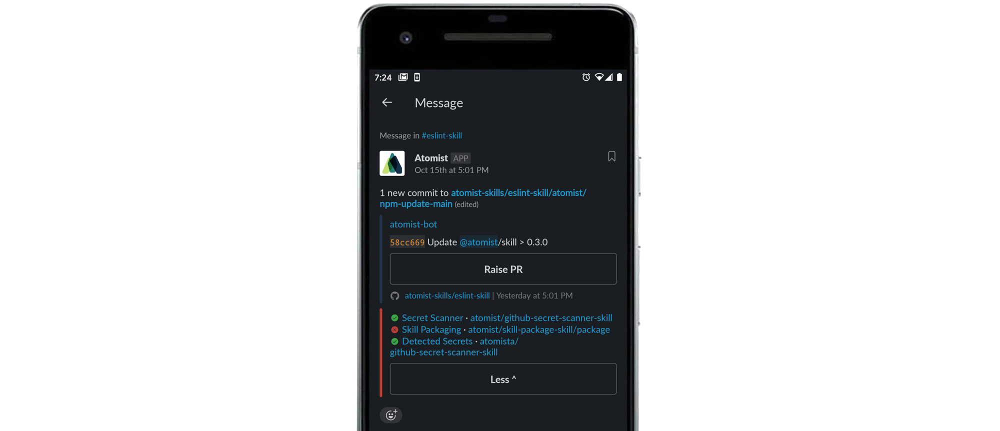
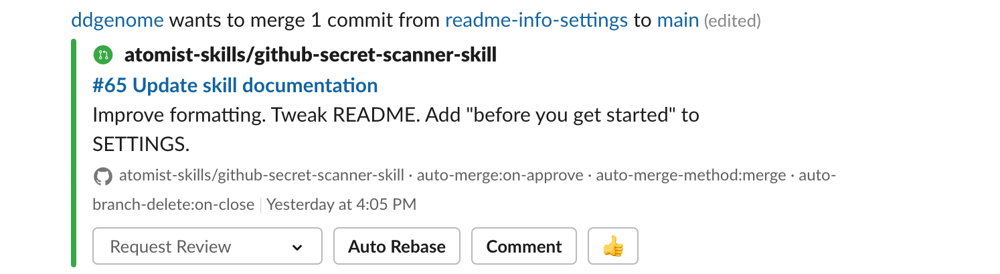
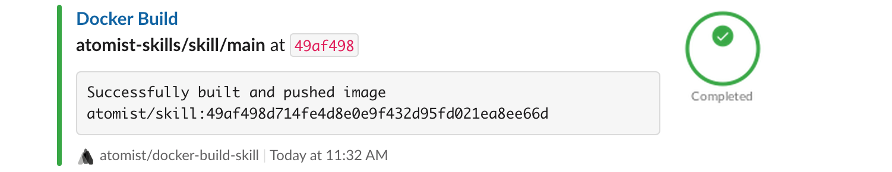
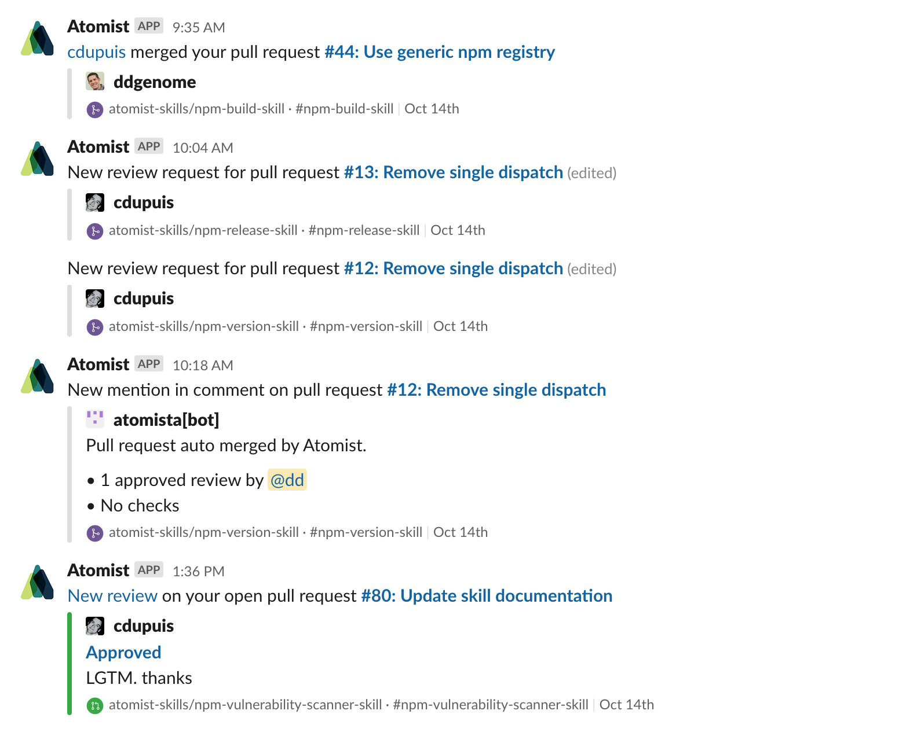

Get rich notifications in chat for activity in your GitHub repositories and
harness the power of ChatOps.

-   See all commit, push, issue and pull request activity in neatly presented
    chat messages
-   Notifications are actionable—react to GitHub activity from Slack or MS
    Teams—comment on issues and PRs, close issues and merge PRs with buttons
    right in the Slack message
-   The same messages and actions are available on your phone with the Slack and
    MS Teams mobile apps
-   Easily configure the amount of information you get in notification messages

Enabling this skill turns on notifications and provides commands for GitHub
actions from Slack or Microsoft Teams.

### See each push in the same channel you discuss the code

### Review all commit checks without leaving chat

### See issues comments and other updates

### See repository activity and take action on your phone

### Get notified when there is a new pull request

### See Atomist Skill executions

### Get DMs when someone requests you review a PR or there is activity on your issues and PRs

