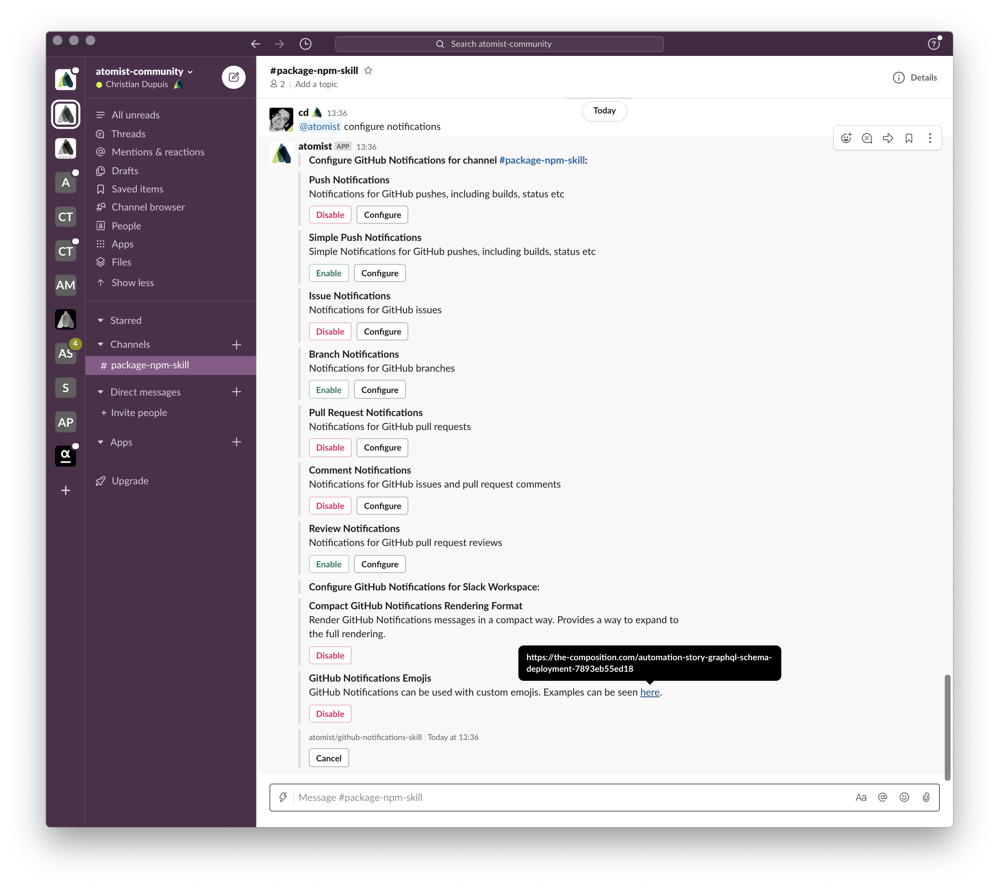
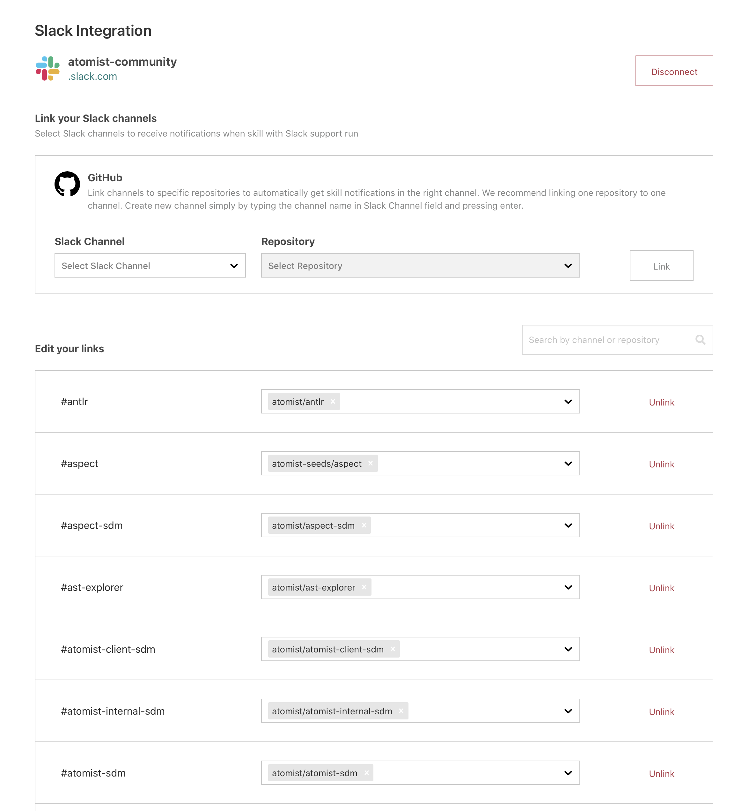

# `atomist/github-notifications-skill`

<!---atomist-skill-readme:start--->

# What it's useful for

Enabling this skill turns on notifications and provides commands for GitHub
activities from Slack or Microsoft Teams.

This skill uses either the Slack or Microsoft Teams integration, which needs to
be configured before using the skill. To choose channels to receive
notifications from repositories, link them on the **Manage > Integrations >
Slack** or **Manage > Integrations > Microsoft Teams** page.

For more information about the Slack integration and channel repository linking,
see [the documentation](https://docs.atomist.com/user/slack/).

# Before you get started

Connect and configure these integrations:

1. **GitHub**
2. **Slack** or **Microsoft Teams**

The **GitHub** integration must be configured in order to use this skill. At
least one repository must be selected. The **Slack** or **Microsoft Teams**
integration needs to be configured.

# How to configure

Configuration of this skill is done in chat. As a direct message with the
`@atomist` bot or in any channel where you have invited `@atomist`, enter and
send this command:

`@atomist configure notifications`

Follow the instructions provided to configure:

-   How notifications work for pushes, issues, pull requests, branches, code
    reviews and commenting
-   Whether to show compact or standard notification messages
-   Add emoji used by these notifications

# How to use GitHub Notifications

1. **Configure the GitHub and Slack integrations**

1. **Link at least one chat channel to a GitHub repository**

    

1. **Make a Git push or modify an issue to see a notification in chat**

1. **Enjoy the increased level of visibility of your GitHub activity right in
   chat!**

To create feature requests or bug reports, create an
[issue in the repository for this skill](https://github.com/atomist-skills/github-notifications-skill/issues).
See the [code](https://github.com/atomist-skills/github-notifications-skill) for
the skill.

<!---atomist-skill-readme:end--->

---

Created by [Atomist][atomist]. Need Help? [Join our Slack workspace][slack].

[atomist]: https://atomist.com/ "Atomist - How Teams Deliver Software"
[slack]: https://join.atomist.com/ "Atomist Community Slack"
