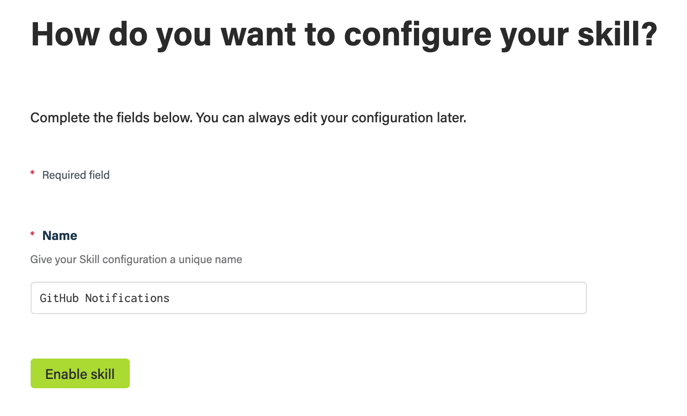
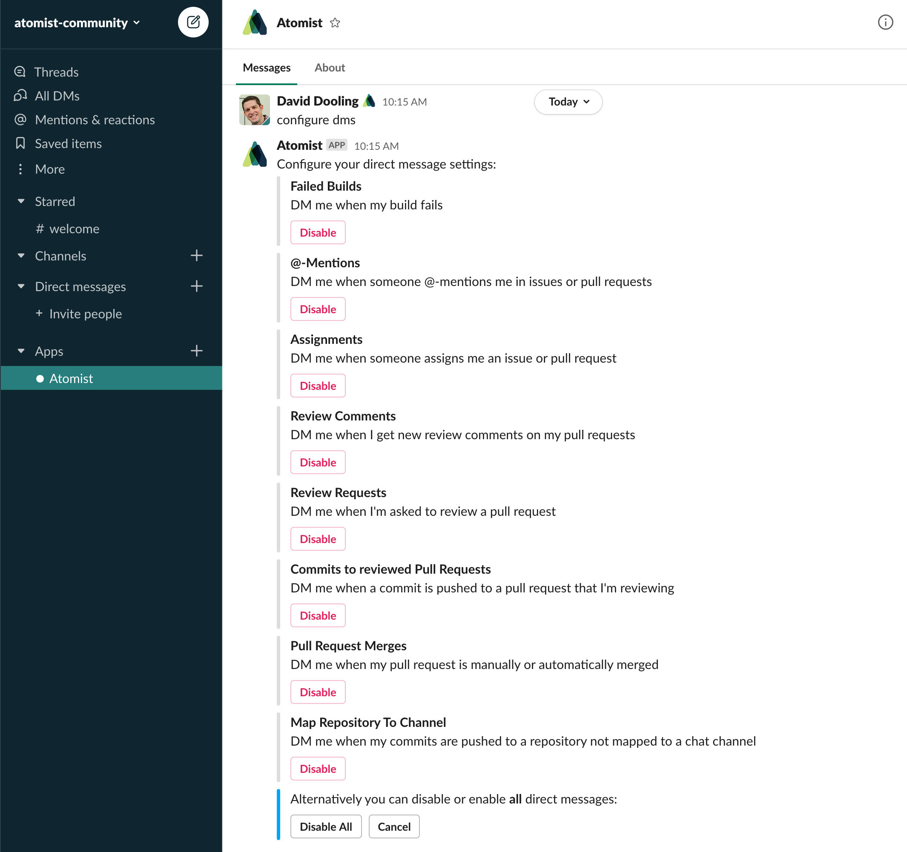

## Before you get started

Connect and configure these integrations:

1.  [**GitHub**][github] _(required)_
2.  [**Slack**][slack] or [**Microsoft Teams**][msteams] _(required)_

[github]: https://go.atomist.com/catalog/integration/github "GitHub Integration"
[slack]: https://go.atomist.com/catalog/integration/slack "Slack Integration"
[msteams]:
    https://go.atomist.com/catalog/integration/microsoft-teams
    "Microsoft Teams Integration"

## How to configure

1.  **Link at least one chat channel to a GitHub repository**

    

    To make sure you get the right notifications in the right place, map your
    GitHub repositories to the chat channels where you discuss each of those
    repositories. We recommend a one-to-one mapping of repositories and
    channels, but feel free to experiment what works best for your team.

    For more information about the Slack integration and channel repository
    linking, see [the documentation](https://docs.atomist.com/user/slack/).

2.  **Activate the skill**

    

    Save your configuration and activate the skill by clicking the "Enable
    skill" button.

Further configuration of this skill is done in chat. To configure the
notifications for a channel, send the follow message in the channel
`@atomist configure notifications`.

Follow the instructions provided to configure:

-   Enable and disable notifications for different sources of activity, i.e.,
    pushes, issues, branches, pull requests, comments, and reviews
-   Select which action buttons, e.g., create tag, comment on issue, raise pull
    request, merge pull request, create release, and add reaction, you want
    available in the chat messages
-   Configure what information is included in the chat messages, e.g., tags,
    releases, and related issues and pull requests
-   Whether to show compact or standard notification messages
-   Add emoji used by these notifications

To configure what GitHub notifications direct messages (DMs) you receive, send
the DM `configure dms` to the Atomist Bot, `@atomist`.

Using the buttons you can enable and disable direct messages sent when, for
example, you are @-mentioned in a issue or pull request comment, someone
requests you review a pull request, you are assigned an issue, or new reviews
are available on a pull requested you created.
